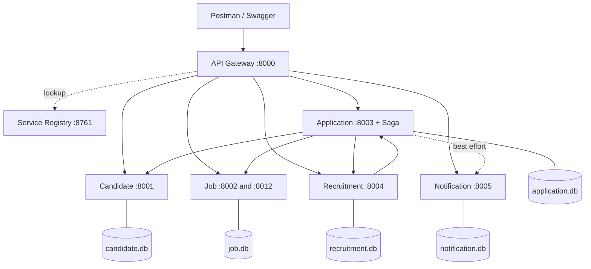

# Job Portal & Recruitment System — Microservices

MCA Microservices Mini Project · **Team 16** · PES University

A focused job portal where candidates apply for jobs and recruiters screen them. It is built as a real
microservices system: every service runs on its own, owns its own database, and talks to other services
only through APIs.

## Distributed-system features

| Requirement | Where it is implemented |
| --- | --- |
| RESTful API design | All services, documented in `docs/api-contracts.md` and Swagger (`/docs`) |
| API versioning | Job Service: `/api/v1/jobs` and `/api/v2/jobs` return different response shapes |
| Service discovery | `service-registry/` (register, heartbeat, TTL) + `common/discovery_client.py` |
| Inter-service communication | REST over HTTP via the discovery client, with timeouts |
| Circuit breaker | `common/circuit_breaker.py`, used in the gateway, Application and Recruitment |
| Database per service | One SQLite file per service, inside that service's `data/` folder |
| Data isolation | Services store only other services' IDs and fetch data through APIs |
| API gateway | `api-gateway/` on port 8000 is the only entry point for clients |
| Saga with compensation | "Apply for Job" saga orchestrated by Application Service |
| Fault tolerance | Timeouts, circuit breaker, fallbacks, compensation retry, notification queue |
| Testing and docs | Postman collection, pytest, Swagger, this repo's `docs/` |

## Architecture



## Services and ports

| Service | Folder | Port | Owner | Owns |
| --- | --- | --- | --- | --- |
| API Gateway | `api-gateway/` | 8000 | Sai | Routing, auth placeholder, request ID |
| Service Registry | `service-registry/` | 8761 | Sai | Service instances and health |
| Candidate Service | `candidate-service/` | 8001 | Saloni | Candidate profiles and skills |
| Job Service | `job-service/` | 8002, 8012 | Sana | Employers, jobs, application slots |
| Application Service | `application-service/` | 8003 | Rishu | Applications, status, saga orchestration |
| Recruitment Service | `recruitment-service/` | 8004 | Saloni | Screenings, interviews, recruiter decisions |
| Notification Service | `notification-service/` | 8005 | Sana | Notifications to candidates |
| Shared library | `common/` | — | Sai | Circuit breaker, discovery client, error format |

Team lead, contracts, integration, testing and documentation: **Sagar**.

> Roles are tentative until the kickoff call.

## Tech stack

Python 3.11+, FastAPI, Uvicorn, SQLite, `requests`, pytest, Postman. No Docker, Kafka or cloud services.

## Repository structure

```
job-portal-microservices/
├── api-gateway/            # single client entry point
├── service-registry/       # service discovery
├── common/                 # circuit breaker, discovery client, shared error format
├── candidate-service/
├── job-service/
├── application-service/    # includes the saga orchestrator
├── recruitment-service/
├── notification-service/
├── docs/                   # architecture and API contracts
├── postman/                # Postman collection and environment
├── tests/                  # end-to-end and failure tests
├── scripts/                # start/stop all services, reset databases
├── .env.example
├── requirements.txt
├── CONTRIBUTING.md
└── README.md
```

## Getting started

```bash
git clone https://github.com/Sagar-Sharma19-cmd/job-portal-microservices.git
cd job-portal-microservices
git checkout develop

python -m venv venv
# Windows:      venv\Scripts\activate
# macOS/Linux:  source venv/bin/activate
pip install -r requirements.txt

cp .env.example .env      # Windows: copy .env.example .env
```

Instructions to start each service and the full system will be added in Phase 0
(`scripts/start_all`).

## How we work

Read [CONTRIBUTING.md](CONTRIBUTING.md) before your first commit. In short: never push to `main`, branch
from `develop`, open a pull request back to `develop`.

## Project status

| Phase | Status |
| --- | --- |
| 0 Contracts and skeleton | In progress |
| 1 Registry and common library | Not started |
| 2 Standalone services | Not started |
| 3 Gateway | Not started |
| 4 Inter-service calls and circuit breaker | Not started |
| 5 Saga | Not started |
| 6 Versioning, notifications, scaling | Not started |
| 7 Testing and failure drills | Not started |
| 8 Docs, slides, viva | Not started |
